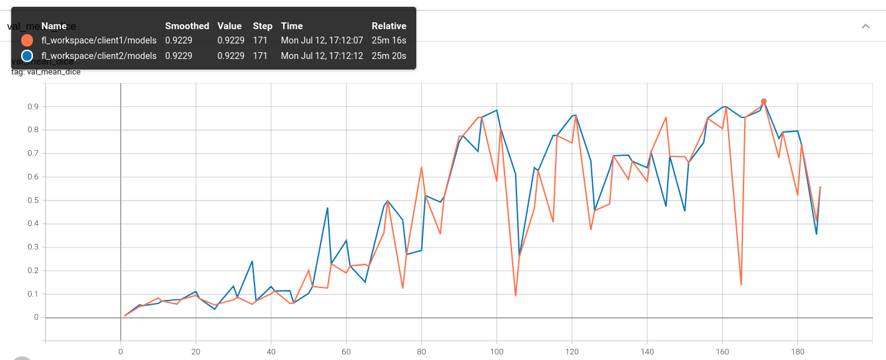

# Federated Learning with MONAI using NVFlare (without docker)
The purpose of this tutorial is to show how to run [NVFlare](https://pypi.org/project/nvflare) with MONAI on a local machine to simulate a FL setting (server and client communicate over localhost).
It is based on the [tutorial](../nvflare_example_docker) showing how to run FL with MONAI and NVFlare which using a docker container for the server and each client.

## Environment setup
(If needed) install pip and virtualenv (on macOS and Linux):
```
python3 -m pip install --user --upgrade pip
python3 -m pip install --user virtualenv
```
(If needed) make all shell scripts executable using
```
find . -name ".sh" -exec chmod +x {} \;
```
initialize virtual environment and set the current folder (see `projectpath` in `set_env.sh`).
```
source ./virtualenv/set_env.sh
```
install required packages
```
pip install --upgrade pip
pip install -r ${projectpath}/virtualenv/requirements.txt
```

install task spooler
```
sudo apt-get update -y
sudo apt-get install -y task-spooler
```

## FL workspace preparation for NVFlare
NVFlare has a "provision" mechanism to automatically generate the fl workspace, see [here](https://docs.nvidia.com/clara/clara-train-sdk/federated-learning/fl_provisioning_tool.html) for details.

In this example, for convenience, we included a pregenerated workspace supporting up to 8 clients which needs to be extracted.
```
unzip ${projectpath}/fl_workspace_pregenerated.zip
```
*Note: (Optional)* If you need to modify the fl workspace (changing the number of max clients, client names, etc.), please follow the instructions [here](https://docs.nvidia.com/clara/clara-train-sdk/federated-learning/fl_provisioning_tool.html). We included the sample project.yml and authz_config.json files used for generating the 8-client workspace under `${projectpath}/fl_utils/workspace_gen`. After modification, the provisioning tool can be run as: `provision -p project.yml -a authz_config.json`

## Task-spooler example - Hyperparameter tuning for spleen segmentation with MONAI
In this example, we used spleen segmentation task with a MONAI-based client trainer under `${projectpath}/spleen_example`
### Download the data
Download the Spleen segmentation task dataset from http://medicaldecathlon.com.
```
${projectpath}/spleen_try1/data/download_dataset.sh
```
This will create a `${projectpath}/data` folder containing the dataset and pre-assigned 8-client datalists.

### Start server and clients
To start the server and clients, run the following script (example with 2 clients).
```
export n_clients=2
${projectpath}/fl_utils/fl_run/start_fl.sh ${n_clients}
```

## Automate running FL runs/trials
*Note:* make sure there is no server or clients running. You can check if a NVFlare process is still running before starting a new experiment via `ps -as | grep nvflare`. Shut them down using the `shutdown` admin commands as described above if there are any.

In new terminal, start environment again (if not already activated)
```
source ./virtualenv/set_env.sh
```
Then, submit the four FL experiment configurations (`spleen_try*`) as tasks to task-spooler using the `tsp` command.
```
export n_clients=2
tsp ${projectpath}/fl_utils/fl_run_auto/run_fl.sh ${n_clients} spleen_try1 1
tsp ${projectpath}/fl_utils/fl_run_auto/run_fl.sh ${n_clients} spleen_try2 2
tsp ${projectpath}/fl_utils/fl_run_auto/run_fl.sh ${n_clients} spleen_try3 3
tsp ${projectpath}/fl_utils/fl_run_auto/run_fl.sh ${n_clients} spleen_try4 4
```
After submitting the tasks, we can check the status with `tsp`

```
ID   State      Output               E-Level  Times(r/u/s)   Command [run=1/1]
0    running    /tmp/ts-out.vZjq5U                           ./fl_utils/fl_run_auto/run_fl.sh 2 spleen_try1 1
1    queued     (file)                                       ./fl_utils/fl_run_auto/run_fl.sh 2 spleen_try2 2
2    queued     (file)                                       ./fl_utils/fl_run_auto/run_fl.sh 2 spleen_try3 3
3    queued     (file)                                       ./fl_utils/fl_run_auto/run_fl.sh 2 spleen_try4 4
```

After the first task is finished, the task queue will be updated.
```
ID   State      Output               E-Level  Times(r/u/s)   Command [run=1/1]
1    running    /tmp/ts-out.znAk7z                           ./fl_utils/fl_run_auto/run_fl.sh 2 spleen_try2 2
2    queued     (file)                                       ./fl_utils/fl_run_auto/run_fl.sh 2 spleen_try3 3
3    queued     (file)                                       ./fl_utils/fl_run_auto/run_fl.sh 2 spleen_try4 4
0    finished   /tmp/ts-out.vZjq5U   0        163.66/0.17/0.04 ./fl_utils/fl_run_auto/run_fl.sh 2 spleen_try1 1
```
Similarly, after finishing the second task.
```
ID   State      Output               E-Level  Times(r/u/s)   Command [run=1/1]
2    running    /tmp/ts-out.6L6qbB                           ./fl_utils/fl_run_auto/run_fl.sh 2 spleen_try3 3
3    queued     (file)                                       ./fl_utils/fl_run_auto/run_fl.sh 2 spleen_try4 4
0    finished   /tmp/ts-out.vZjq5U   0        163.66/0.17/0.04 ./fl_utils/fl_run_auto/run_fl.sh 2 spleen_try1 1
1    finished   /tmp/ts-out.znAk7z   0        163.50/0.19/0.02 ./fl_utils/fl_run_auto/run_fl.sh 2 spleen_try2 2
```

Here, you can also use the admin client as show above to monitor the automatically started FL experiments. Just open a terminal and execute
```
source ./virtualenv/set_env.sh
${projectpath}/fl_workspace/admin/startup/fl_admin.sh
```
(username: `admin@nvidia.com`)

## Visualize the training progress
To visualize the training progress, run tensorboard in the server/client terminal:
```
tensorboard --logdir="./" &
```
and point your browser to `http://localhost:6006/#scalars`. You should see the performance of the global model to be the same at the beginning of each round, as the clients in this example all share the same validation set across several runs/trials.


## Further reading
For more details visit the [NVFlare documentation](https://pypi.org/project/nvflare).
For more examples using NVFlare, see [here](https://github.com/NVIDIA/clara-train-examples/tree/master/PyTorch/NoteBooks/FL).
